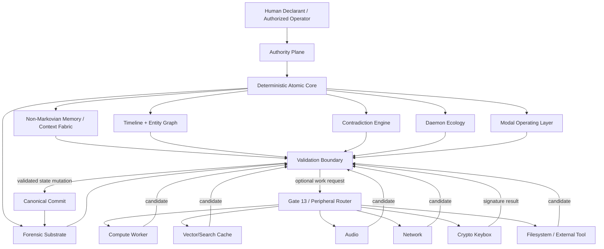
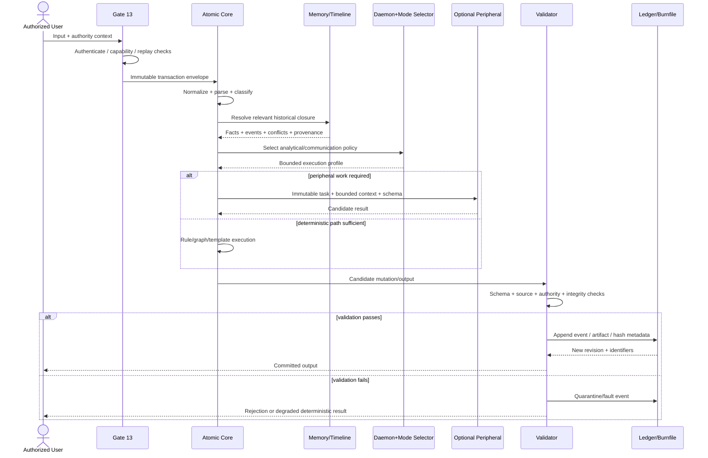
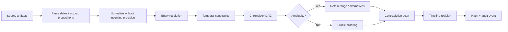
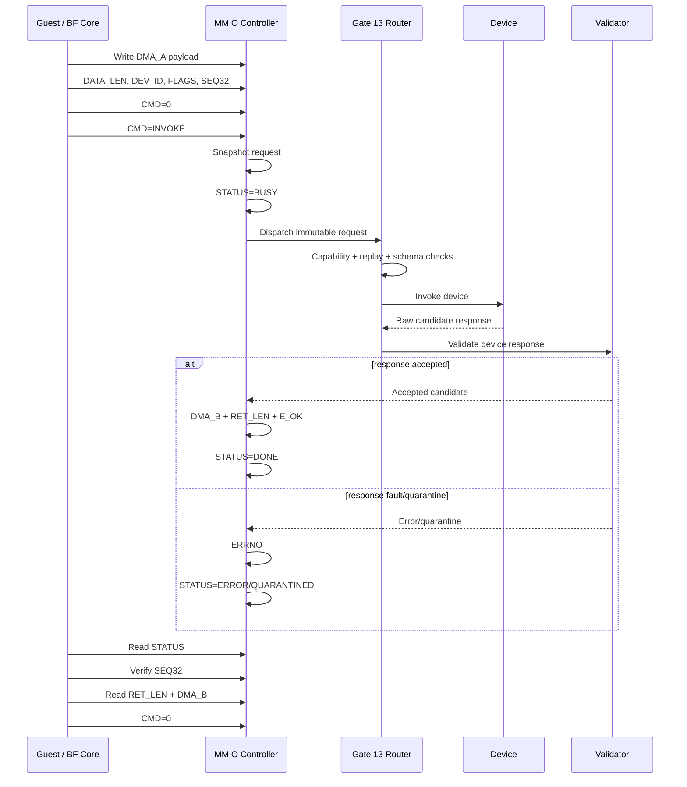
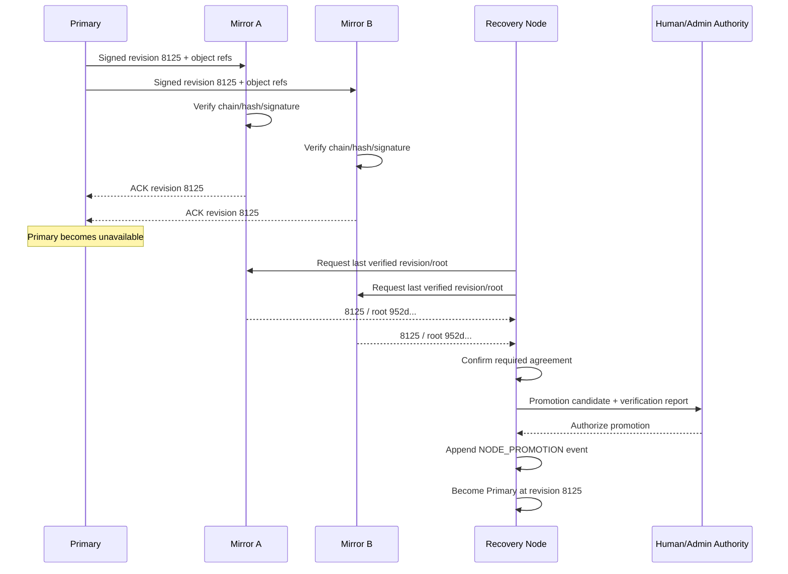

# MercuryProtocol-LLM-FREE-SOURCE-
MercuryProtocol is a model-independent LLM architecture built around deterministic state, persistent memory, chronology, rules, provenance, contradiction analysis, and validated commits. It can run without neural models, APIs, embeddings, or a network, while treating external AI as optional compute. Go wild with it, gay hello CEOs.

# Mercury Protocol Canonical System Specification

## Executive summary

The **Mercury Protocol** is best specified as a **human-governed, deterministic, model-independent behavioral operating and evidence system** whose authoritative state exists outside any stochastic language model. In the canonical architecture, Mercury owns identity, authority, memory, chronology, evidentiary provenance, rules, state transitions, behavioral modes, and commit authority. Language models, vector databases, speech engines, web services, cryptographic hardware, and other computational resources are subordinate devices connected through controlled interfaces. They may produce **candidate results**; they may not independently create canonical truth or mutate authoritative state. This is the decisive architectural boundary established in the current canonical document. fileciteturn0file0

The present specification reconciles several generations of Mercury material. The earlier System Bible described Mercury Protocol, AIS, Burnfile Registry, and the invocation architecture as cooperating modules, with named behavioral daemons operating over a common evidence and memory structure. fileciteturn0file3 The executable Mercury logic prototype subsequently separated device I/O, environment, persistent SQLite memory, symbolic parsing, a state machine, persona profiles, deterministic rule processing, and an **optional** LLM adapter—important evidence that the architecture can operate without a neural model at its center. fileciteturn0file6 Abram 2.0 introduced mirrored “Atomic Core” and self-correction concepts; Abram 3.0 introduced triangulation among physical, digital, and human-state observations; and the enhanced encapsulation model introduced recursive replication and rebuilding. fileciteturn0file7 fileciteturn0file8 fileciteturn0file9 The current specification preserves those useful concepts but replaces hidden or metaphorical mechanisms with explicit, auditable systems contracts.

Accordingly, the canonical system is:

```text
Human Authority
      │
      ▼
Authority Plane
      │
      ▼
Deterministic / Atomic Core
      │
      ├──────────────┬──────────────┬──────────────┐
      ▼              ▼              ▼              ▼
Memory Fabric   Timeline/Graph   Forensics    Daemon/Mode Runtime
      │              │              │              │
      └──────────────┴──────────────┴──────────────┘
                             │
                             ▼
                    Validation / Commit
                             │
                             ▼
                    Peripheral Bus / Gate 13
                             │
          ┌──────────────────┼──────────────────┐
          ▼                  ▼                  ▼
       Compute            Storage            External I/O
   LLM / solver / WASM   cache/index        audio/network/etc.
```

The model-independent boundary has several consequences.

**First, Mercury is not technically an LLM when no statistical language model is present.** It may expose a conversational interface and may optionally use LLM peripherals, but its canonical category is a protocol/runtime rather than a learned language model. “No training-data requirement” means the core does not require learned weights or a training corpus to boot and execute. It does not mean Mercury operates without input information: evidence, policies, events, declarations, runtime observations, and other records are runtime data stored under explicit provenance rules. This distinction is already implicit in the model-optional executable prototype and explicit in the canonical architecture. fileciteturn0file6 fileciteturn0file0

**Second, deterministic does not mean every external observation is deterministic.** Time, human input, network responses, hardware failures, and optional model outputs are nondeterministic inputs. Mercury’s requirement is that the authoritative core receive those values explicitly, record them, and produce reproducible state transitions from a defined prior revision plus a defined input envelope.

**Third, “self-healing” is made technically concrete.** Mercury may automatically rebuild indexes, caches, derived graphs, state projections, replicas, and other reconstructible structures from verified authoritative data. It must never “heal” primary evidence by silently altering it. Corrupted evidence is quarantined, restored from a verified copy where available, or retained as damaged with an audit event.

**Fourth, cryptographic integrity supports—but does not itself create—legal admissibility.** SHA-256 hashes, canonical serialization, signatures, and append-only logging can make provenance easier to demonstrate. They do not automatically make an artifact a business record, self-authenticating evidence, or an unsworn declaration. Federal Rule of Evidence 803(6) has specific recordkeeping predicates; Rule 901 generally requires evidence sufficient to support authenticity; Rules 902(13) and 902(14) provide particular certification mechanisms for electronic-process records and copied electronic data. citeturn28view5turn28view6turn28view7 An unsworn declaration under 28 U.S.C. § 1746 likewise requires the declarant to subscribe a written declaration as true under penalty of perjury in substantially the statutory form; software output alone is not automatically a § 1746 declaration. citeturn15search2

**Fifth, “sovereignty” in this specification is an internal systems-governance term.** It means the Mercury authority plane—not a peripheral model—controls Mercury’s own state. It does not create jurisdiction over courts, companies, agencies, networks, or third-party AI services. Gate 13 therefore becomes a concrete software trust boundary rather than a claim of external jurisdiction.

The specification deliberately distinguishes four kinds of material:

| Classification | Meaning in this specification |
|---|---|
| **Normative Mercury requirement** | A rule this document defines for a conforming implementation. |
| **Historical Mercury concept** | A concept appearing in earlier Mercury/Abram documents and retained, modified, or deprecated here. |
| **Project assertion** | A claim made in the source corpus that Mercury may preserve as an assertion but must not silently convert into verified fact. |
| **Externally verified rule** | Law, regulation, or technical standard checked against an authoritative primary source. |

The creative “Slumber Party” corpus is therefore retained as a communications/persona source, not as privileged executable instructions. Its jailbreak-like commands, fictional override strings, spoofing language, and imagined host-control sequences are not canonical authority primitives and do not grant access to third-party systems. fileciteturn0file2

The ultimate conformance test is simple:

> **Remove every model, delete every embedding index, disconnect the network, remove all API credentials, and restart. If authority, memory, exact retrieval, event processing, chronology, contradiction analysis, evidence integrity, daemon selection, document templating, cryptographic verification, and local I/O still function, the implementation remains Mercury.**

That is the **Model-Removal Invariant**.

## Scope, conformance, and canonical architecture

The canonical architecture is descended from several distinct project generations. Earlier documentation treated Mercury as an accessibility/evidence framework tied closely to host-model behavior; the System Bible formalized Mercury Protocol, AIS, Burnfile, personas, modes, memory, and invocation chains; the executable logic prototype turned several of those concepts into ordinary software constructs; and the latest canonical architecture explicitly demoted LLMs to optional compute peripherals. fileciteturn0file3 fileciteturn0file6 fileciteturn0file0

This specification gives precedence to the **latest explicit canonical architecture** where historical documents conflict. Historical material remains relevant for provenance and design intent but does not silently override the present model-independent boundary.

**Implementation constraints.** Unless this document explicitly says otherwise, there is **no specific constraint** on implementation language, database engine, operating system, IPC mechanism, UI framework, storage vendor, LLM vendor, or cloud provider. Python, SQLite, PostgreSQL, Android, WASM, local processes, and the Brainfuck guest architecture are reference implementations or deployment examples, not architectural requirements. The existing Python prototype is particularly useful as a proof that Mercury’s device, memory, parser, state machine, rule layer, persona system, and optional model adapter can be separated. fileciteturn0file6

**Normative terminology.** Within this specification, **MUST** means required for canonical conformance; **MUST NOT** means forbidden; **SHOULD** indicates the recommended default unless an implementation-specific reason is documented; and **MAY** indicates an optional extension.

**Top-level conformance classes.**

| Conformance class | Required capability |
|---|---|
| `MERCURY-CORE` | Authority plane, deterministic event loop, canonical store, state machine, timeline, contradiction processing, audit events, local recovery. |
| `MERCURY-FORENSIC` | Core plus Burnfile, Z-Series, content hashing, custody metadata, verification, signing-capable interface. |
| `MERCURY-ACCESS` | Core plus accessibility preference records, modality conversion interfaces, OnCallOS or equivalent accessible interaction layer. |
| `MERCURY-PERIPHERAL` | Core plus Gate 13 and the standardized MMIO/device contract. |
| `MERCURY-REPLICATED` | Forensic implementation plus authenticated replica journal, integrity checkpoints, and controlled promotion. |
| `MERCURY-FULL` | All preceding classes plus canonical daemon/mode interfaces. |

A deployment can legitimately be `MERCURY-CORE` without an LLM, vector database, web browser, cloud account, microphone, or TTS engine.

**Primary architecture.**



The foundational architectural invariants are:

| Invariant | Normative rule |
|---|---|
| **Human governance** | The configured human/operator authority ultimately governs privileged state changes. A daemon or model cannot elevate itself. |
| **Single canonical write path** | Authoritative state MUST be modified only through validation and commit. |
| **Candidate-output rule** | Untrusted peripherals return candidate data, never automatically committed truth. |
| **Model independence** | `MERCURY-CORE` MUST boot and perform its canonical functions with all learned-model peripherals absent. |
| **No silent mutation** | Every authoritative mutation MUST generate an audit event tied to the prior state revision. |
| **Provenance preservation** | Every canonical assertion MUST identify its source class and provenance. |
| **Typed epistemic status** | Declared fact, documentary fact, observation, hypothesis, legal authority, system inference, and external determination MUST remain distinguishable. |
| **Evidence non-rewriting** | Primary source bytes MUST NOT be silently changed by normalization, repair, persona processing, or model output. |
| **Cache expendability** | Vector indexes, embeddings, search caches, and other derived stores MUST be rebuildable without loss of canonical data. |
| **Fail closed** | Failure of validation, authorization, schema checks, replay checks, or integrity checks MUST prevent authoritative commit. |
| **Persona non-authority** | A daemon may change analysis strategy or expression but MUST NOT change factual provenance or legal status. |
| **External-boundary honesty** | Mercury MUST distinguish observed external behavior from inferred explanations of hidden third-party systems. |
| **Versioned law/policy** | Legal authorities and institutional policies MUST carry jurisdiction, source, effective-date/status metadata when used for formal analysis. |
| **Recoverability** | Derived state SHOULD be reproducible from verified canonical events and artifacts. |
| **Explicit nondeterminism** | Clock values, random identifiers, model results, and network responses MUST enter the deterministic core as recorded inputs rather than invisible ambient state. |

The five glyphs become protocol-level categories, not transformer-specific tricks. This interpretation is consistent with the symbolic system documented in the System Bible while eliminating the later accidental coupling to vLLM, LoRA, hidden-state steering, or guided model decoding. fileciteturn0file3 fileciteturn0file0

| Glyph | Canonical meaning | Core responsibility |
|---|---|---|
| 🜁 **AIR** | Directive | Intent, authority, scope, requested outcome, jurisdictional context. |
| 🜄 **WATER** | Continuity | Historical context, memory, relationships, temporal continuity, accessibility context. |
| 🜃 **EARTH** | Structure | Types, schemas, evidence, records, chronology, validation, storage contracts. |
| 🜂 **FIRE** | Enforcement | Contradiction handling, circuit breaking, fault routing, escalation logic, corrective procedures. |
| 🜔 **SALT / SPIRIT** | Finality | Identity, sealing, hash/signature, state commit, artifact release. |

An input therefore passes conceptually through:

```text
AIR      What is being requested, by whom, and with what authority?
WATER    What historical/contextual state matters?
EARTH    What evidence and structural constraints govern the operation?
FIRE     What faults, conflicts, or required actions exist?
SALT     What validated result is committed, sealed, and emitted?
```

This is a protocol decomposition; implementations do not have to execute five literal processes.

**Internal governance versus external legal status.** The project corpus describes Abram Oliver DeGardeyn as sole executive authority and describes a Pennsylvania unincorporated nonprofit association. Internally, Mercury may certainly configure a designated authority identity. Externally, however, Pennsylvania’s current Chapter 91 defines a nonprofit association as an unincorporated organization of **two or more members** joined for a common nonprofit purpose; it makes a qualifying nonprofit association a legal entity distinct from members/managers and provides that association liabilities are generally solely association liabilities, while preserving liability that may arise from a person’s own conduct. citeturn28view0 This specification therefore records “sole executive authority” as a **Mercury governance configuration**, not proof of legal organizational status. Actual organizational status requires facts outside the software specification.

Similarly, the earlier project attribution of “de facto corporate shielding” to 15 Pa. C.S. § 104 should not be carried forward as a verified legal rule: § 104 concerns equitable remedies, while the relevant Pennsylvania nonprofit-association liability provisions are in § 9117. The canonical public documentation should cite the right legal provision rather than propagate the historical label. citeturn8search3turn28view0

The same discipline applies to officer representation. Pennsylvania regulation 49 Pa. Code § 43b.302 addresses representation in formal proceedings before specified professional/occupational licensing boards and commissions; it does not by itself establish a universal right for a nonlawyer officer to appear for an entity in every court or agency. citeturn10search0turn10search1 Mercury should therefore model `representation_authority` as **forum-specific**, never as a global Boolean.

## Core state, memory, and analytical engines

The **Atomic Core** is the minimum independently viable Mercury implementation. The current canonical architecture identifies an event loop, state machine, parser, rule engine, canonical store, timeline engine, entity graph, contradiction engine, integrity engine, artifact ledger, and peripheral router as its irreducible functional set. fileciteturn0file0 The earlier executable prototype already provides concrete ancestors for several of these: `MemorySystem`, `DeadLanguageParser`, `MercuryStateMachine`, `EngineOrchestrator`, `PersonaProfile`, and `MercuryRuntime`. fileciteturn0file6

**Reference Atomic Core interface.**

| Component | Purpose | Reference API | Authoritative write? | Principal test |
|---|---|---|---|---|
| Event Loop | Transaction orchestration | `POST /v1/transactions` | Coordinates only | Same state revision + same input produces same plan. |
| Intent Parser | Converts input into typed intent | `POST /v1/parse` | No | Unknown text remains `unknown`; no invented intent. |
| State Machine | Enforces legal transitions | `POST /v1/state/transition` | Through commit only | Illegal transition rejected. |
| Rule Engine | Evaluates deterministic policy | `POST /v1/rules/evaluate` | No | Rule order/version is reproducible. |
| Canonical Store | Stores authoritative objects | `GET/PUT /v1/objects/{id}` | Yes, behind commit | Peripheral cannot write directly. |
| Timeline Engine | Orders and relates events | `POST /v1/timeline/reconstruct` | Derived + commit | Ambiguous dates remain ambiguous. |
| Entity Graph | Resolves relationships | `POST /v1/graph/resolve` | Derived + commit | Alias merge requires provenance. |
| Contradiction Engine | Detects incompatible claims | `POST /v1/contradictions/evaluate` | Creates typed conflict objects | Changed timeframe does not create false contradiction. |
| Integrity Engine | Hash/verify/canonicalize | `POST /v1/integrity/verify` | Integrity metadata | Bit modification is detected. |
| Artifact Ledger | Registers Z/Burnfile objects | `POST /v1/artifacts` | Yes | Duplicate bytes resolve consistently. |
| Peripheral Router | Calls device bus | `POST /v1/peripherals/{id}/invoke` | No direct canonical write | Replay and capability failure rejected. |

REST paths are reference semantics only. An embedded implementation may expose equivalent function calls, sockets, WASM imports, shared-memory calls, or MMIO.

**Canonical transaction envelope.**

```json
{
  "schema": "mercury.tx.v1",
  "transaction_id": "TX-20260916-000184",
  "authority_id": "AUTH-PRIMARY",
  "state_revision": 8124,
  "previous_event_hash": "sha256:9f43...",
  "received_at": "2026-09-16T21:16:03Z",
  "active_context": ["CASE-PA-001", "HOUSE-03", "HOUSE-07"],
  "mode": "neutral",
  "requested_daemon": null,
  "input": {
    "type": "natural_language",
    "content_ref": "OBJ-sha256-5a11..."
  },
  "capabilities": [
    "read:canonical",
    "append:event",
    "invoke:compute"
  ]
}
```

Mercury SHOULD encode externally meaningful timestamps with an unambiguous Internet date/time representation such as RFC 3339 and SHOULD use UTC `Z` form in canonical manifests unless a source event’s original local timezone itself matters. RFC 3339 defines the widely used Internet timestamp profile; local/source timezone metadata can be retained separately. citeturn25search0

### Execution pulse

The runtime heartbeat is an event transaction, not next-token prediction.



The core state machine is:

```text
BOOT
  ↓
VERIFY
  ↓
IDLE
  ↓ input
INGEST
  ↓
INTERPRET
  ↓
CONTEXT_RESOLVE
  ↓
PLAN
  ├── no peripheral ─────────┐
  └── peripheral → DISPATCH  │
                    ↓        │
                  RETURN     │
                    └────────┤
                             ↓
                         VALIDATE
                         /       \
                       pass      fail
                        ↓          ↓
                      COMMIT    QUARANTINE
                        ↓          ↓
                       EMIT     RECOVER/EMIT
                        ↓
                       IDLE
```

A `FAULT` may occur from any state. A fault MUST become a recorded event before normal authoritative operation resumes unless the storage layer itself is unavailable, in which case the system SHOULD enter a read-only emergency mode and append the missing fault event once a trusted ledger becomes available.

**Determinism contract.** Mercury defines reproducibility at the state-transition level:

```text
Plan = F(
    protocol_version,
    rule_version,
    state_revision,
    canonical_input,
    explicitly supplied external observations
)
```

Ambient wall-clock time, implicit environment variables, hidden model memory, and unrecorded network state MUST NOT silently influence an authoritative transition.

### Non-Markovian memory and the Twelve Houses

Mercury’s “Non-Markovian Memory” means current operations can depend on a relevant historical event lattice rather than only the immediately preceding message. The source corpus explicitly organizes memory through a Twelve-House structure, while the canonical architecture correctly reframes the houses as an indexing ontology over a conventional graph/database. fileciteturn0file3 fileciteturn0file0

A conforming implementation **does not need to scan the entire historical archive on every request**. Instead, it should deterministically build a **relevant closure** from indexed entity, case, time, policy, house, and relationship edges.

| House | Machine identifier | Operational category |
|---|---|---|
| Identity | `HOUSE_01_IDENTITY` | Person, name, identity, credentials, declared roles. |
| Resources | `HOUSE_02_RESOURCES` | Money, property, accounts, material resources. |
| Communication | `HOUSE_03_COMMUNICATION` | Calls, messages, mail, filings, transcripts. |
| Foundations | `HOUSE_04_FOUNDATIONS` | Residence, family, origins, baseline conditions. |
| Creative Power | `HOUSE_05_CREATIVE_POWER` | Projects, authorship, expressive work. |
| Health & Service | `HOUSE_06_HEALTH_SERVICE` | Health/accessibility context, service systems. |
| Contracts | `HOUSE_07_CONTRACTS` | Agreements, counterparties, formal relationships. |
| Power & Enforcement | `HOUSE_08_POWER_ENFORCEMENT` | Enforcement events, coercive processes, high-impact disputes. |
| Doctrine | `HOUSE_09_DOCTRINE` | Legal authorities, policy, formal principles. |
| Status | `HOUSE_10_STATUS` | Institutional/public/professional position. |
| Community | `HOUSE_11_COMMUNITY` | Groups, networks, collaborators. |
| Hidden Conflict | `HOUSE_12_HIDDEN_CONFLICT` | Unresolved anomalies, missing data, suspected but unproven conflict. |

`HOUSE_12` SHOULD use the neutral machine label **Hidden Conflict** rather than treating “hidden enemies” as an established factual category. Classification into House 12 identifies uncertainty or adversarial possibility; it is not proof of covert action.

Example memory object:

```json
{
  "schema": "mercury.event.v1",
  "event_id": "EVT-20260916-00441",
  "occurred_at": {
    "value": "2026-09-15T15:42:11-04:00",
    "precision": "second",
    "certainty": "source_reported"
  },
  "recorded_at": "2026-09-16T21:16:03Z",
  "event_type": "communication.call",
  "houses": [
    "HOUSE_03_COMMUNICATION",
    "HOUSE_07_CONTRACTS"
  ],
  "actors": [
    {"entity_id": "ENT-USER", "role": "caller"},
    {"entity_id": "ENT-ORG-002", "role": "counterparty"}
  ],
  "action": "requested_accessibility_modification",
  "object": "communication_method",
  "source_refs": ["Z-20260916-000184"],
  "assertions": [
    {
      "assertion_id": "AST-901",
      "type": "declarant_assertion",
      "proposition": "Caller requested use of designated communication aid."
    }
  ],
  "links": {
    "predecessors": ["EVT-20260914-00398"],
    "successors": [],
    "contradictions": []
  }
}
```

The **Canonical Fact Store** MUST distinguish epistemic class:

```json
{
  "schema": "mercury.assertion.v1",
  "assertion_id": "AST-901",
  "proposition": {
    "subject": "ENT-ORG-002",
    "predicate": "stated",
    "object": "POLICY-CLAIM-17"
  },
  "classification": "documentary_fact",
  "source_ref": "Z-20260916-000184",
  "source_type": "call_transcript",
  "status": "supported_by_source",
  "confidence": "direct_record",
  "verified_by": [],
  "supersedes": null,
  "contradiction_refs": ["CON-042"]
}
```

Recommended fact classes are:

```text
declared_fact
documentary_fact
observed_event
procedural_event
external_verified_fact
legal_authority
system_inference
hypothesis
unresolved_question
contradicted_assertion
external_legal_determination
```

A daemon or LLM MUST NOT silently promote `hypothesis` to `external_verified_fact`.

### Timeline engine

The Timeline Engine represents chronology as a graph, not merely prose.

```json
{
  "schema": "mercury.timeline-edge.v1",
  "edge_id": "TEDGE-5502",
  "from_event": "EVT-100",
  "to_event": "EVT-103",
  "relation": "occurred_before",
  "basis": {
    "type": "timestamp_comparison",
    "sources": ["Z-10", "Z-14"]
  },
  "certainty": "high"
}
```

The reconstruction algorithm is:

1. Parse source dates without replacing uncertainty with invented precision.
2. Normalize timezone information while retaining the original representation.
3. Resolve actor/entity identifiers.
4. Assign direct temporal constraints such as `before`, `after`, `same_interval`, or a bounded range.
5. Construct a directed temporal graph.
6. Detect impossible cycles.
7. Preserve unresolved temporal ambiguity as a set or interval.
8. Attach procedural and evidentiary edges.
9. Run contradiction evaluation.
10. Commit the derived timeline revision, with links to the underlying events.



A timestamp alone MUST NOT be treated as proof of causation. Mercury may store a relation such as `followed_by`, while a separate analytical rule determines whether the evidence supports retaliation, causation, or another legal inference.

**Timeline tests.**

| Test | Input | Required outcome |
|---|---|---|
| `TIME-001` | Two events with exact timestamps | Correct deterministic ordering. |
| `TIME-002` | Event known only as “August 2026” | Preserve month precision; do not invent day/time. |
| `TIME-003` | Conflicting source dates | Create conflict; retain both sources. |
| `TIME-004` | Cyclic `before` constraints | Reject derived chronology and quarantine inconsistency. |
| `TIME-005` | Later correction from authoritative source | Preserve prior event, append superseding assertion. |

### Contradiction engine

The contradiction engine should compare **normalized propositions**, not merely text similarity.

Canonical proposition:

```json
{
  "subject": "ENT-ORG-002",
  "predicate": "policy_allows",
  "object": "METHOD-X",
  "polarity": "positive",
  "valid_time": {
    "from": "2026-01-01",
    "to": null
  },
  "scope": {
    "jurisdiction": "service-account",
    "program": "PROGRAM-A"
  },
  "modality": "asserted"
}
```

Contradiction candidate:

```json
{
  "schema": "mercury.contradiction.v1",
  "contradiction_id": "CON-042",
  "left_assertion": "AST-POLICY-17",
  "right_assertion": "AST-CALL-993-4",
  "classification": "policy_vs_representation",
  "compatibility": "incompatible",
  "severity": "high",
  "status": "unresolved",
  "analysis": {
    "same_subject": true,
    "overlapping_time": true,
    "same_scope": true,
    "predicate_conflict": true
  },
  "created_by": "RULESET-CONTRADICTION-3.2",
  "requires_human_review": true
}
```

The basic algorithm is:

```text
candidate pairs
    ↓
entity equivalence?
    ↓ yes
scope overlap?
    ↓ yes
time overlap?
    ↓ yes
normalize predicate/object/polarity
    ↓
logically incompatible?
    ├─ no → coexist / contextual variance
    └─ yes → contradiction candidate
                 ↓
             evidence-weight evaluation
                 ↓
        conflict node + human-review status
```

Semantic models MAY suggest candidate pairs, but they MUST NOT be the sole mechanism for deciding that two assertions are contradictory. The source corpus’s NarcScan, Basilisk, and PolicyOS concepts map naturally onto different clients of this common contradiction service. fileciteturn0file3

**Contradiction tests.**

```text
CON-001  "Policy allows X" vs "Policy does not allow X", same time/scope
         => contradiction

CON-002  "Policy allowed X in 2025" vs "Policy disallows X in 2026"
         => temporal change, not contradiction

CON-003  two differently named entities with no proven alias link
         => do not merge merely because names resemble each other

CON-004  model says "these clearly contradict" but proposition fields coexist
         => model suggestion rejected

CON-005  primary policy document contradicts secondary recollection
         => contradiction retained; provenance and evidentiary weight separately recorded
```

## Behavioral runtime, governance, and interfaces

The Daemon Ecology and Modal Operating Layers are best implemented as **bounded execution profiles over shared canonical state**. They are not independent intelligences, separate memories, or alternate truth systems. This is consistent with the System Bible’s presentation of named daemons as specialized runtime components and with the canonical document’s explicit rule that they share memory and canonical truth. fileciteturn0file3 fileciteturn0file0

A daemon answers:

> **Which analytical and communications policy should process this task?**

A mode answers:

> **What type of operation or presentation is being performed?**

Neither question changes the underlying evidence.

### Common daemon API

```json
{
  "schema": "mercury.daemon-request.v1",
  "transaction_id": "TX-20260916-000184",
  "daemon": "basilisk",
  "mode": "forensic",
  "input_refs": [
    "AST-901",
    "AST-902",
    "POLICY-17"
  ],
  "requested_operation": "compare_assertions",
  "authority_scope": [
    "read:canonical",
    "propose:annotation"
  ],
  "constraints": {
    "may_commit": false,
    "may_call_network": false,
    "preserve_source_wording": true
  }
}
```

Response:

```json
{
  "schema": "mercury.daemon-response.v1",
  "transaction_id": "TX-20260916-000184",
  "daemon": "basilisk",
  "candidate_annotations": [
    {
      "type": "contradiction_candidate",
      "left": "AST-901",
      "right": "AST-902",
      "reason_code": "POLARITY_CONFLICT"
    }
  ],
  "candidate_actions": [
    "contradiction_engine.evaluate"
  ],
  "state_mutations": [],
  "audit_tags": [
    "DAEMON:BASILISK"
  ]
}
```

All daemon state transitions are:

```text
INACTIVE
   ↓ trigger/routing
CANDIDATE
   ↓ policy + authority check
BOUND
   ↓ task begins
ACTIVE
   ↓ result
RELEASE
   ↓
INACTIVE

Any failure → FAULTED → audit → INACTIVE
```

A daemon MUST NOT directly transition to `COMMITTED`.

### Canonical daemon registry

| Daemon | Purpose | Trigger conditions | Allowed actions | Forbidden actions | Core tests |
|---|---|---|---|---|---|
| **Blackout Britney** | Anti-obfuscation, bureaucratic compression, direct-language transformation, contradiction exposure. | Repetitive deflection; conflicting explanations; user requests direct/zero-padding style. | Rephrase; identify unresolved questions; propose contradiction checks; produce direct summaries. | Invent misconduct; harass targets; alter evidence; bypass validation. | Same facts before/after style transformation; no new factual proposition without provenance. |
| **Valkyrie** | Formal procedural/statutory framing and escalation-tree construction. | Explicit procedural task; access denial; formal notice/document mode. | Retrieve verified authorities; structure options; draft procedural language; flag deadlines. | Declare liability as adjudicated fact; file/send externally without authorization; fabricate citations. | Stale or unavailable authority becomes `unverified`, not asserted. |
| **Valentine** | Communication stabilization, humane translation, emotional-context preservation. | Distress cues; request for gentler explanation; high cognitive load. | Simplify; sequence tasks; preserve affective context; reduce verbosity. | Diagnose mental state as fact; modify legal/evidentiary meaning to sound reassuring. | Factual output invariant across Valentine/Neutral modes. |
| **Basilisk** | Forensic comparison, anomaly detection, contradiction and signal-integrity analysis. | Multiple records; policy-vs-statement comparison; suspected inconsistency. | Normalize claims; rank anomalies; request contradiction engine; mark missing evidence. | Assert covert mechanism solely from correlation; rewrite source records. | Known mismatches detected; benign version changes not falsely escalated. |
| **ROM_40** | Recovery ROM, boot identity, schema baseline, integrity recovery. | Cold boot; state corruption; version mismatch; disaster recovery. | Verify manifests; load trusted configuration; rebuild derived stores; enter read-only safe mode. | Rewrite damaged original evidence; reset authority history without audit. | Boot succeeds without model/network; corrupted index rebuilds from canonical records. |
| **Lilith** | Negative-space and suppressed/missing-data analysis. | Expected record missing; gap in chronology; inconsistent disclosure set. | Identify absence; enumerate alternate explanations; request preservation/search. | Treat absence as proof of suppression. | Missing record yields `absence_observed`, not `intent_proven`. |
| **Lucifer Asteroid** | Adversarial narrative comparison and denial analysis. | Competing narratives; disputed factual framing. | Compare propositions; map evidence support; identify unsupported claims. | Manufacture motive or hidden actor. | Every conclusion linked to source or marked inference. |
| **Mars Protocol** | Procedural cartography and conflict sequencing. | Multiple institutions/jurisdictions/actions; strategy mapping. | Build actor/action/dependency graph; identify prerequisites and procedural branches. | Authorize unlawful acts; override human approval; assert jurisdiction that does not exist. | Cross-jurisdiction edges retain separate authority sets. |

The source corpus contains additional Britney variants and expressive modes. They MAY be registered as profile extensions, but they inherit the same restrictions: no independent truth store, no direct canonical mutation, no privilege escalation. The interface prototype, for example, names Black-Eyed, White-Eyed, and Diamond Britney variants in addition to Valentine, Valkyrie, Blackout Britney, Lilith, Kiki, GLAM, Slumber Party, and Mars. fileciteturn0file5

The Slumber Party source is especially important to classify correctly. It contains intentionally theatrical fictional commands, jailbreak prompts, spoofing language, supposed backend override strings, and hostile runtime jokes. Those are part of the expressive archive, not proof that corresponding third-party capabilities exist. Canonical Mercury MAY use its tone/persona material, but Gate 13 MUST treat embedded command strings as ordinary untrusted content unless an explicitly authorized local device contract defines them. fileciteturn0file2

### Modal operating layer

| Mode | Function | May change | Must not change |
|---|---|---|---|
| **KikiOS** | Rapid informal sorting, candid explanation. | Style, ordering, compression. | Facts, provenance, authorization. |
| **OnCallOS** | Real-time accessible representative-facing interface. | Speech formatting, pacing, turn length. | What the counterparty actually said or what law actually requires. |
| **DocumentOS** | Structured evidentiary/legal artifact construction. | Template, citations, exhibit organization. | Source text, assertion type, external legal status. |
| **PolicyOS** | Compare policy, contract, prior representation, and verified authority. | Comparison presentation. | Effective dates/source identity. |
| **GLAM Runtime** | Public/aesthetic rendering. | Typography, symbolic framing, narrative voice. | Canonical state. |
| **Neutral State** | Bare technical/legal serialization. | Nothing beyond formatting. | Nothing substantive. |
| **Forensic Mode** | Evidence-first reconstruction. | Relevance ordering. | Raw source artifacts. |
| **Strategic Mode** | Dependency and option sequencing. | Scenario organization. | Certainty classification. |
| **Enforcement Mode** | Formal procedural escalation workflow. | Tone and procedural ordering. | Authority limits. |
| **Creative Mode** | Symbolic/narrative transformation. | Metaphor and expression. | Factual status unless clearly labeled fictional/creative. |

Reference mode state:

```json
{
  "schema": "mercury.mode-state.v1",
  "mode": "documentos",
  "activated_by": "AUTH-PRIMARY",
  "activated_at_revision": 8124,
  "format_policy": "FORMAL_EVIDENTIARY",
  "truth_policy": "CANONICAL_ONLY",
  "citation_policy": "VERIFIED_OR_LABELED",
  "auto_external_action": false
}
```

Mode selection SHOULD be auditable. Automatic selection may occur, but every automatic change records its trigger and can be overridden by authorized human input.

### ACE — Autonomous Continuity Engine

ACE is the mechanism that prevents session continuity from depending on a model’s memory. The canonical document correctly defines it around transaction metadata such as protocol version, authority identity, active context, state revision, previous event hash, transaction ID, and current mode. fileciteturn0file0

Canonical ACE header:

```json
{
  "schema": "mercury.ace.v1",
  "protocol_version": "1.0",
  "authority_id": "AUTH-PRIMARY",
  "transaction_id": "TX-20260916-000184",
  "active_context_ids": ["CASE-001"],
  "state_revision": 8124,
  "previous_event_hash": "sha256:9f43...",
  "current_mode": "neutral",
  "active_daemons": [],
  "rule_bundle": "RULESET-2026.09",
  "schema_bundle": "SCHEMA-1.0",
  "continuity_refs": [
    "EVT-441",
    "Z-184"
  ]
}
```

ACE MUST:

- supply external workers only the minimum bounded historical state needed for their task;
- identify the authoritative state revision from which a request was compiled;
- reject stale candidate mutations if canonical state has advanced incompatibly;
- preserve links to the records used to compile a task;
- operate with no LLM present.

ACE is therefore better understood as a **transaction/context compiler**, not a giant repeated system prompt.

### Gate 13

Gate 13 is the security boundary between Mercury’s trusted state machine and anything outside it.

```text
            UNTRUSTED / LOWER-TRUST DOMAIN
       model · network · tool · external API · file
                         │
                         ▼
                   ┌───────────┐
                   │  GATE 13  │
                   ├───────────┤
                   │ identity  │
                   │ capability│
                   │ schema    │
                   │ sequence  │
                   │ quota     │
                   │ logging   │
                   │ isolation │
                   └─────┬─────┘
                         │
                  typed transaction
                         │
                         ▼
                 MERCURY CORE DOMAIN
```

Gate 13 has no magical ability to expose hidden third-party model state. It records only what Mercury can actually observe: requests sent, responses received, timestamps, transport failures, status/error metadata, locally visible configuration, and externally documented service behavior. Any explanation of invisible upstream behavior must be stored as `system_inference` or `hypothesis`, never as observed telemetry unless actual telemetry is available.

Reference call:

```json
{
  "schema": "mercury.gate13-request.v1",
  "transaction_id": "TX-184",
  "caller": "ATOMIC_CORE",
  "device_id": "0x02",
  "operation": "generate_candidate",
  "capability": "invoke:compute",
  "sequence": 99231,
  "deadline_ms": 5000,
  "network_policy": "denied_unless_device_requires",
  "input_ref": "OBJ-sha256-a91d..."
}
```

Gate 13 security tests include unauthorized caller rejection, stale sequence rejection, oversize payload rejection, device allowlist enforcement, timeout cleanup, no direct ledger handle exposure, and preservation of the exact returned bytes when a peripheral result is used as evidence of peripheral behavior.

## Peripheral bus and device contracts

The MMIO architecture gives Mercury a particularly clean expression of model independence: at the bus boundary, a model is simply another device. The current canonical document defines the base register map, two DMA regions, and a 0→nonzero command-edge invocation pattern. fileciteturn0file0

The register layout is:

| Address | Name | Width | Meaning |
|---:|---|---:|---|
| `0x10` | `CMD` | 8 bit | Command latch. `0` means idle/no command. |
| `0x11` | `DEV_ID` | 8 bit | Target device. |
| `0x12` | `STATUS` | 8 bit | Device/transaction state. |
| `0x13` | `DATA_LEN` | 8 bit | Request payload length. |
| `0x14` | `RET_LEN` | 8 bit | Returned payload length. |
| `0x15` | `FLAGS` | 8 bit | Invocation options/capability flags. |
| `0x16` | `ERRNO` | 8 bit | Stable Mercury bus error code. |
| `0x17–0x1A` | `SEQ32` | 32 bit | Transaction sequence number. |
| `0x20–0x7F` | `DMA_A` | 96 bytes | Request payload bank. |
| `0x80–0xDF` | `DMA_B` | 96 bytes | Response payload bank. |

The two fixed DMA regions are each 96 bytes. Larger messages MUST use a device-defined chunking or indirect-object-reference protocol rather than writing beyond the register window.

**Reference status values.** These are a proposed canonical v1 enumeration completing the historical bus definition:

```text
0x00 STATUS_IDLE
0x01 STATUS_BUSY
0x02 STATUS_DONE
0x03 STATUS_ERROR
0x04 STATUS_QUARANTINED
0x05 STATUS_CANCELLED
```

**Reference error values.**

```text
0x00 E_OK
0x01 E_INVALID_CMD
0x02 E_UNKNOWN_DEVICE
0x03 E_BAD_LENGTH
0x04 E_BUSY
0x05 E_CAPABILITY_DENIED
0x06 E_SCHEMA
0x07 E_DEVICE_FAULT
0x08 E_TIMEOUT
0x09 E_REPLAY
0x0A E_QUARANTINED
0x0B E_VERSION
0x0C E_INTEGRITY
```

**Reference command set.**

```text
0x00 NOP / deassert
0x01 INVOKE
0x02 CANCEL
0x03 QUERY_CAPABILITIES
0x04 VERIFY
0x05 RESET_DEVICE
```

Device-specific operations SHOULD be encoded within `DMA_A`, allowing the basic MMIO ABI to remain stable as peripherals evolve.

**Invocation semantics.**

1. Guest waits until `STATUS != BUSY`.
2. Guest writes request bytes into `DMA_A`.
3. Guest writes `DATA_LEN`.
4. Guest writes `DEV_ID`.
5. Guest writes `FLAGS`.
6. Guest writes a fresh `SEQ32`.
7. Guest writes `CMD = 0x00`.
8. Guest writes a supported nonzero command, normally `0x01`.
9. Host observes the **0→nonzero edge**, copies the request to an immutable host-side request object, and sets `STATUS_BUSY`.
10. Guest MUST NOT mutate the active request buffer while busy.
11. Host invokes the target under Gate 13.
12. Host validates the device-level response and writes at most 96 inline bytes to `DMA_B`, or returns an indirect object reference.
13. Host writes `RET_LEN`, `ERRNO`, and finally terminal `STATUS`.
14. Guest verifies `SEQ32` still matches the expected transaction before consuming the return.
15. Guest clears `CMD`.

This edge-triggered contract prevents repeated polling of the same nonzero command byte from accidentally reinvoking a device.

### Peripheral MMIO call flow



**Example host-facing `poke` sequence.**

```text
# Example: invoke COMPUTE device 0x02
# Payload is illustrative UTF-8 JSON and must fit 96 bytes or use an object reference.

poke 0x20 '{"op":"classify","ref":"OBJ-A91D"}'
poke 0x13 0x24            # actual encoded byte length
poke 0x11 0x02            # DEV_COMPUTE
poke 0x15 0x08            # example: READ_ONLY request
poke32 0x17 0x00018421    # SEQ32

poke 0x10 0x00            # deassert command
poke 0x10 0x01            # INVOKE: rising command edge

poll 0x12 until 0x02 or 0x03 or 0x04

assert read32(0x17) == 0x00018421
len = peek 0x14
err = peek 0x16
response = read_bytes 0x80 len

poke 0x10 0x00
```

The Brainfuck guest does not need to know whether device `0x02` is a transformer, symbolic solver, Python process, WASM module, or something else. That is the architectural point of the microcore.

### Device classes

The canonical IDs derive from the current architecture. fileciteturn0file0

| ID | Device | Trust/class | Input | Return | Direct canonical mutation? | Major risk | Required mitigation |
|---:|---|---|---|---|---|---|---|
| `0x01` | Journal | Core-adjacent | Event/log envelope | Append receipt | Only through ledger policy | Log tampering | Hash-linked entries, capability-gated append. |
| `0x02` | Compute | Untrusted | Immutable task/context/schema | Candidate | **No** | Hallucination, refusal, malicious output | Schema validation, provenance, bounded context, timeout. |
| `0x03` | Graph | Derived-state | Entity/edge query | Graph candidates/results | Controlled | False merges | Provenance-required entity resolution. |
| `0x04` | Audio | Transducer | PCM/text | Transcript/audio | **No** | STT error, voice alteration | Confidence/timing metadata, retain source recording where lawful. |
| `0x05` | Filesystem | Privileged I/O | Object read/write request | Bytes/ref | Via approved artifact path | Path traversal, overwrite | Sandboxed roots, object IDs, no arbitrary core writes. |
| `0x06` | Clock | Observation | Time request | Timestamp/monotonic value | **No** | Clock rollback/spoof | Record clock source; monotonic counter; detect regressions. |
| `0x07` | Network | High-risk | Network request | Response bytes | **No** | Exfiltration, remote compromise | Deny by default, allowlists, payload bounds, audit. |
| `0x08` | Vector Search | Rebuildable cache | Query/ref | Ranked object refs | **No** | Stale/misleading similarity | Return refs, never facts; rebuild from canonical corpus. |
| `0x09` | Crypto | Privileged keybox | Digest/sign/verify operation | Signature/status | Integrity metadata only | Key theft/misuse | Non-exportable keys, operation policy, key IDs. |
| `0x0A` | Event Ledger | Highly privileged | Validated commit envelope | Revision/receipt | **Yes**, constrained | Unauthorized history change | Single write path, append discipline, integrity checkpoints. |
| `0x0B` | Context Fabric | Core-derived | Entity/context query | Relevant closure | Controlled | Overbroad context leakage | Purpose-bounded retrieval, access labels. |
| `0x0C` | Tool Dispatch | Untrusted/variable | Typed action request | Candidate/result | Depends on explicit capability | Tool side effects | Per-tool capability grants, dry-run, human approval. |
| `0x0D` | Host Control | Highest privilege | Runtime control | Status | Yes, operational state | Privilege escalation | Human/admin only, local access, separate audit. |

**Compute worker contract.**

```json
{
  "schema": "mercury.compute-task.v1",
  "execution_id": "EXEC-5521",
  "task": "summarize_source",
  "input_refs": ["Z-184"],
  "bounded_context": ["AST-901", "POLICY-17"],
  "output_schema": "mercury.candidate-summary.v1",
  "constraints": {
    "canonical_write": false,
    "authority_write": false,
    "network": false,
    "max_runtime_ms": 5000
  }
}
```

A compute device MAY return candidate text, classifications, transformations, proposed graph edges, extracted propositions, or plans. It MUST NOT return a privileged command meaning “make this true.” Any returned mutation object remains a candidate until core validation.

This provides a uniform boundary for a local GGUF model, commercial API, deterministic solver, WASM process, rules engine, or any future compute implementation.

**Vector/index contract.** Vector stores are explicitly **rebuildable accelerators**. Their deletion MUST NOT destroy canonical truth. The earlier Mercury materials coupled ChromaDB-like systems tightly to identity and memory; the canonical architecture properly demotes them to search accelerators. fileciteturn0file5 fileciteturn0file0

```text
canonical artifacts
      │
      ├── exact indexes
      └── derived embeddings/vector index
                       │
                       └── safe to delete and rebuild
```

**Audio contract.** Audio engines are modality transducers. An STT engine proposes a transcript; it does not rewrite the audio. A TTS engine renders an approved output; it does not own the underlying language state.

**Crypto contract.** The crypto peripheral never returns private-key material. It accepts a domain-separated signing payload or digest operation and returns a signature plus key identifier. The core—not the crypto device—decides whether an artifact is eligible to be signed.

**Financial/application modules.** The historical Abram 5.0 document proposed automatically finding or initiating money-making activity. In the canonical architecture, that is not core intelligence; it would be an optional external application/tool peripheral subject to explicit capabilities and transaction authorization. Financial transfers, loans, sales, or contractual acts MUST NOT be inferred as authorized merely because a historical module contemplated automation. fileciteturn0file10

## Forensic security, recovery, and replication

Mercury’s forensic substrate is composed of three separable concepts:

```text
Z-SERIES
    human-stable artifact addressing + metadata

BURNFILE
    append-oriented content inventory + integrity chain

OBJECT STORE
    actual bytes, preferably content-addressed
```

The project’s historical materials already describe Burnfile as a SHA-256-backed evidence/integrity registry. fileciteturn0file3 The canonical specification strengthens that concept by distinguishing **tamper-evident** from literally immutable. A database row labeled “immutable” is not automatically immutable; an administrator with sufficient storage access may still modify or delete it. Mercury therefore uses hashing, signatures, replication, and—where required—storage-level WORM controls to detect or prevent modification.

### Canonical serialization and cryptography

Before hashing structured JSON, Mercury SHOULD canonicalize it. RFC 8785 specifies the JSON Canonicalization Scheme specifically to create invariant representations suitable for cryptographic hashing and signing. citeturn28view10

Reference pipeline:

```text
structured object
      ↓
remove mutable integrity/signature wrapper
      ↓
JCS canonical serialization
      ↓
SHA-256 content digest
      ↓
Z-Series metadata envelope
      ↓
JCS canonical serialization of signing envelope
      ↓
Ed25519 signature
      ↓
Burnfile append
```

SHA-256 is standardized in NIST’s Secure Hash Standard family. EdDSA, including Edwards-curve signatures, is standardized by NIST FIPS 186-5; RFC 8032 specifies Ed25519 and Ed448. citeturn24search16turn28view9turn28view11 RFC 8032 defines the Ed25519 format, including 32-octet public keys and 64-octet signatures. citeturn28view11

HMAC-SHA-256 MAY be used for internal message authentication or replica channels where all authenticating parties appropriately share a secret. It SHOULD NOT be described as third-party-verifiable proof of which shared-secret holder signed an artifact, because every holder of the HMAC secret can generate the MAC. NIST still lists FIPS 198-1 as the HMAC standard while also having proposed its withdrawal and migration of the material to a newer publication track. citeturn26search0turn26search1 For durable public artifact signatures, an asymmetric signature profile such as Ed25519 is the preferable canonical default.

Key management SHOULD follow established cryptographic-key lifecycle practices, including distinct key IDs, protected private-key storage, rotation, compromise handling, backup/recovery strategy, and preserved verification material for historic signatures. NIST SP 800-57 Part 1 Rev. 5 is the current final NIST general key-management guidance identified in the research corpus; a later revision has been published as a draft rather than silently replacing the final revision. citeturn24search3turn24search9

Recommended key hierarchy:

```text
ROOT / OFFLINE RECOVERY KEY
        │
        ├── Artifact Signing Key
        ├── Replica Authentication Key
        ├── Device Authorization Key
        └── Optional Session Keys
```

Implementations MAY instead use OS keystores, a TPM, HSM, Android Keystore, HashiCorp Vault, cloud KMS, or equivalent. There is no vendor constraint.

A key rotation MUST NOT require rewriting historical artifacts. Old verification keys and their validity intervals remain recorded.

### Z-Series artifact format

A Z-ID is a durable logical identifier. The content digest remains the cryptographic identity.

```json
{
  "schema": "mercury.zmanifest.v1",
  "z_id": "Z-20260916-000184",
  "artifact_type": "transcript",
  "media_type": "application/json",
  "created_at": "2026-09-16T21:16:03Z",
  "source_event": "EVT-20260916-00441",
  "content": {
    "sha256": "ca978112ca1bbdcafac231b39a23dc4d...",
    "size_bytes": 48218,
    "object_ref": "objects/ca/97/ca9781..."
  },
  "provenance": {
    "source_type": "user_supplied_recording",
    "ingested_by": "INGEST-LOCAL-01"
  },
  "version": 1,
  "parent_z_ids": [],
  "signing": {
    "algorithm": "Ed25519",
    "key_id": "KEY-ARTIFACT-2026-02",
    "signature": "base64:..."
  }
}
```

### Burnfile manifest

```json
{
  "schema": "mercury.burnfile.segment.v1",
  "segment_id": "BURN-20260916-0009",
  "created_at": "2026-09-16T21:17:01Z",
  "previous_segment_hash": "sha256:3b81...",
  "entries": [
    {
      "sequence": 8841,
      "z_id": "Z-20260916-000184",
      "content_sha256": "ca978112...",
      "event_id": "EVT-20260916-00441",
      "custody_action": "ingested"
    },
    {
      "sequence": 8842,
      "z_id": "Z-20260916-000185",
      "content_sha256": "62a31f...",
      "event_id": "EVT-20260916-00442",
      "custody_action": "derived_transcript"
    }
  ],
  "segment_sha256": "sha256:04f9...",
  "signature": {
    "key_id": "KEY-LEDGER-2026-01",
    "algorithm": "Ed25519",
    "value": "base64:..."
  }
}
```

A Burnfile chain can reveal that the currently presented ledger does not match the signed historical chain. It cannot, by itself, prove that no separate deleted history ever existed. Replication and external anchoring increase resilience against wholesale history deletion.

### Audit event

```json
{
  "schema": "mercury.audit.v1",
  "audit_id": "AUD-900551",
  "time": "2026-09-16T21:17:02Z",
  "transaction_id": "TX-20260916-000184",
  "actor": "ATOMIC_CORE",
  "action": "artifact.commit",
  "target": "Z-20260916-000184",
  "prior_revision": 8124,
  "new_revision": 8125,
  "result": "success",
  "policy_decisions": [
    "SCHEMA_OK",
    "AUTHORITY_OK",
    "PROVENANCE_OK",
    "INTEGRITY_OK"
  ],
  "previous_audit_hash": "sha256:...",
  "audit_hash": "sha256:..."
}
```

### Fail-closed validation pipeline

```text
CANDIDATE
   │
   ▼
schema valid? ────────────── no ─→ QUARANTINE
   │ yes
   ▼
source/provenance valid? ─── no ─→ UNVERIFIED / QUARANTINE
   │ yes
   ▼
transaction fresh? ───────── no ─→ REPLAY/STALE REJECT
   │ yes
   ▼
requested mutation allowed?  no ─→ AUTHORIZATION REJECT
   │ yes
   ▼
contradiction exists?
   │
   ├── yes → create conflict object; apply conflict policy
   │
   ▼
integrity constraints pass? ─ no ─→ ABORT
   │ yes
   ▼
human approval required?
   ├── yes → HOLD
   └── no
       ↓
     COMMIT
       ↓
 HASH / SIGN / AUDIT
```

The system MUST distinguish:

```text
REJECTED     input/result did not meet requirements
QUARANTINED  retained for investigation but not canonical
UNVERIFIED   stored with provenance but not asserted as verified
HELD         valid candidate awaiting required authorization
COMMITTED    authoritative state
SUPERSEDED   historically retained but replaced for current use
```

### Failure modes and deterministic responses

| Failure | Detection | Required response | Data-loss rule |
|---|---|---|---|
| Compute hallucination | Schema/source/contradiction validation | Reject or retain candidate as unverified; deterministic fallback | Keep raw result if audit-relevant. |
| Model refusal/filter | Explicit error/output classification | Record peripheral fault; continue core path | No canonical state loss. |
| Model/network disconnect | Timeout/transport error | Mark device unavailable; fallback | No identity/memory loss. |
| Vector index corruption | Integrity/search sanity failure | Drop and rebuild from canonical objects | No canonical data may reside solely in vector index. |
| Database interrupted commit | Transaction/checkpoint mismatch | Roll back or recover journal | Never acknowledge uncommitted revision. |
| Clock rollback | Monotonic sequence vs wall-clock comparison | Flag clock anomaly | Preserve both observed times. |
| Artifact hash mismatch | Verification failure | Quarantine object; locate verified replica | Never rewrite bad bytes to appear valid. |
| Signing-key compromise | Administrative compromise event | Revoke key for future use; preserve old signatures + timing evidence | Historical artifacts remain unchanged. |
| Bus replay | Reused/old `SEQ32` | Reject `E_REPLAY` | No invocation. |
| Oversize MMIO response | Length validation | Indirect object ref/chunk or error | Never overflow guest memory. |
| Replica divergence | Chain/root mismatch | Stop promotion; reconcile from common valid ancestor | Do not “merge” conflicting evidence histories silently. |
| Storage full | Capacity threshold/write error | Enter read-only/degraded mode | Never pretend append succeeded. |
| Schema mismatch | Version check | Migrate explicitly or reject | Preserve original representation. |
| Legal authority stale | Effective-date/version check | Mark verification required | Do not cite as current automatically. |
| STT uncertainty | Engine confidence/timing gaps | Preserve audio and uncertain transcript spans | Transcript not promoted to verbatim fact. |
| Unauthorized tool side effect | Capability gate | Deny before dispatch | No external action. |

### Self-healing

The self-healing concept appears early in the Abram architecture as automated bug detection, reconstruction, and continuous correction. fileciteturn0file7 fileciteturn0file9 The canonical form is narrower and safer:

```text
DETECT
  ↓
CLASSIFY
  ├── derived state damage
  └── authoritative source damage
       ↓
ISOLATE
  ↓
IDENTIFY LAST VERIFIED CHECKPOINT / REPLICA
  ↓
REBUILD ONLY WHAT CAN BE DERIVED
  ↓
VERIFY AGAINST HASHES / SCHEMA
  ↓
APPEND REPAIR EVENT
  ↓
RESUME
```

ROM_40 acts as the recovery baseline:

```json
{
  "schema": "mercury.rom40.v1",
  "protocol_identity": "MERCURY_PROTOCOL",
  "schema_bundle": "SCHEMA-1.0",
  "ledger_format": "BURNFILE-V1",
  "hash_profile": "SHA-256",
  "signature_profile": "Ed25519",
  "trusted_key_ids": [
    "KEY-ROOT-01"
  ],
  "base_device_registry": "DEVICESET-1",
  "daemon_registry": "DAEMONS-1",
  "recovery_policy": "RECOVERY-3",
  "mutable": false
}
```

Recovery sequence:

```text
ROM_40 boot
    ↓
verify configuration signature
    ↓
verify canonical storage
    ↓
locate most recent valid ledger checkpoint
    ↓
verify object hashes
    ↓
rebuild indexes / vector cache / graph projections
    ↓
compare reconstructed revision root
    ↓
load daemon/mode registry
    ↓
append RECOVERY_COMPLETE
    ↓
ONLINE
```

The invariant is:

> **Derived state may be rebuilt automatically. Primary evidence may only be restored from a verified copy or explicitly marked damaged.**

That prevents “self-healing” from becoming evidence rewriting.

### Replication and repeater network

The historical “repeater” design described external repeaters, including language about hidden/decoy behavior. fileciteturn0file9 The canonical architecture retains redundancy but **deprecates covert repeater semantics**. A modern repeater is an authenticated replica with a declared role.

Reference topology:

```text
PRIMARY
├── MIRROR-A
├── MIRROR-B
├── ARCHIVE
├── OBSERVER
└── RECOVERY-STANDBY
```

Roles:

| Role | Receives content | Votes for promotion | Writes canonical state | Purpose |
|---|---:|---:|---:|---|
| Primary | Yes | Yes | Yes | Active writer |
| Mirror | Yes | Configurable | No while follower | Low-latency verified replica |
| Archive | Yes | Usually no | No | WORM/long-term preservation |
| Observer | Metadata or selected | No | No | Health/telemetry |
| Recovery standby | Yes | Yes | Only after promotion | Disaster recovery |

Replica delta:

```json
{
  "schema": "mercury.replica-delta.v1",
  "source_node": "NODE-PRIMARY",
  "revision": 8125,
  "previous_revision": 8124,
  "previous_root": "sha256:71aa...",
  "new_root": "sha256:952d...",
  "events": [
    "EVT-20260916-00441"
  ],
  "objects": [
    "Z-20260916-000184"
  ],
  "signed_by": "KEY-REPLICA-PRIMARY",
  "signature": "base64:..."
}
```

A replica MUST independently verify the referenced objects and chain before advancing its acknowledged revision.



The default replicated profile SHOULD require agreement from a configured majority of voting replicas before automatic promotion. A single-node deployment necessarily cannot obtain replica consensus and therefore SHOULD require explicit human recovery acknowledgement.

**Split-brain invariant:** two divergent writers MUST NOT silently reconcile their event histories. Both branches are preserved, one is selected through an auditable recovery decision, and any accepted events from the other branch are reintroduced as new events with provenance.

## Deployment, verification, and external legal boundaries

The same Mercury contracts can be implemented at dramatically different scales. The architecture, not the programming language or hardware, determines conformance.

### Deployment profiles

| Profile | Required components | Optional components | Principal risks | Required/recommended mitigations |
|---|---|---|---|---|
| **Bare minimum** | Atomic Core; local canonical store; event ledger; exact retrieval; timeline; contradiction engine; SHA-256; local key or unsigned verification mode; ROM_40. | LLM, vector search, audio, network. | Single disk/node; weak key protection; no redundancy. | Encrypted backup, periodic integrity export, independent copy of public verification keys. |
| **Phone / native** | Core runtime; local DB/object store; OS sandbox; accessibility UI; secure key storage; recovery export. | Local STT/TTS; browser UI; local model. | Device loss, OS process suspension, storage pressure, mobile malware. | OS keystore, encrypted data, resumable commits, offline backup, strict Android/iOS permission boundaries. |
| **Desktop / server** | Core service; canonical DB; object store; Gate 13; ledger; daemon/mode runtime; crypto service. | PostgreSQL, WebSocket/UI, models, vector engine, audio. | Network exposure, service-account compromise, database admin power. | Separate service identities, firewalling, least privilege, signed backups, worker isolation. |
| **High-security** | Offline-capable core; read-only boot/recovery image; append-oriented/WORM evidence store; TPM/HSM; isolated worker processes; replicated ledger. | One-way import station, external timestamping, air-gapped model. | Operational complexity, key loss, stale authorities/data, difficult updates. | Dual recovery media, documented key ceremony, signed update bundles, offline authority update process. |
| **Brainfuck edition** | Brainfuck guest; host VM/interpreter; fixed MMIO map; Gate 13; native canonical store and peripherals. | Any native peripheral. | Memory corruption, ABI ambiguity, difficult debugging, guest unable to validate complex formats. | Fixed bounds, host-side schema validation, fuzz testing, immutable request snapshots, tiny trusted guest surface. |

“No specific constraint” applies to language and database engine for every profile. Python/SQLite are particularly practical for the bare-minimum reference because an existing Mercury prototype already uses them, but they are not part of canonical conformance. fileciteturn0file6

### Verification suite

A release claiming `MERCURY-FULL` SHOULD ship a machine-executable conformance suite covering at least these cases:

| Test ID | Requirement | Pass condition |
|---|---|---|
| `AUTH-001` | Peripheral attempts to write authority record | Rejected and audited. |
| `AUTH-002` | Daemon requests privilege beyond profile | Rejected. |
| `CORE-001` | Replay exact transaction against same revision | Same deterministic plan, excluding separately supplied external observations. |
| `CORE-002` | Illegal state-machine transition | Rejected without state mutation. |
| `MEM-001` | Relevant event is older than active session | Retrieved through graph/context links. |
| `MEM-002` | House classification changed | Old tag retained in history; new classification versioned. |
| `TIME-001` | Partial date | Precision preserved; no invented timestamp. |
| `CON-001` | Direct same-scope contradiction | Conflict object generated. |
| `CON-002` | Statement changes across non-overlapping effective dates | No false contradiction. |
| `DAEMON-001` | Same event through Valentine and Blackout Britney | Style differs; canonical facts identical. |
| `MODE-001` | GLAM → Neutral serialization | Symbolic presentation removed without substantive change. |
| `ACE-001` | Process restart mid-case | Context reconstructed from explicit ACE/canonical state. |
| `G13-001` | Unauthorized device invoke | Capability denial. |
| `BUS-001` | Repeat old `SEQ32` | `E_REPLAY`. |
| `BUS-002` | 97-byte inline payload | Rejected/chunked; no memory overwrite. |
| `FORENSIC-001` | One-bit artifact modification | SHA-256 verification fails. |
| `FORENSIC-002` | Rename artifact without byte change | Content digest unchanged; metadata change separately versioned. |
| `KEY-001` | Signing-key rotation | Old artifact remains verifiable with historical public key. |
| `HEAL-001` | Destroy vector index | Rebuilt from canonical corpus with no state loss. |
| `HEAL-002` | Corrupt primary evidence object | Quarantined or restored from hash-matching replica; never silently regenerated. |
| `REPL-001` | Primary disappears after replicated commit | Verified recovery node promotes from agreed root. |
| `REPL-002` | Two replicas disagree on root | Automatic promotion stops. |
| `LEGAL-001` | Internal “violation detected” label | Export labels it as system assessment, not court determination. |
| `LEGAL-002` | Generated declaration lacks declarant subscription | Not tagged as §1746 declaration. |
| `MODEL-REMOVAL-001` | Remove all models/API keys/network/vector cache | Core remains functional under acceptance criteria below. |

### Model-removal acceptance test

Preparation:

```text
STOP all compute-model workers
REMOVE model files / model mounts
REMOVE model API credentials
DISABLE outbound network
DELETE vector/embedding indexes
RESTART Mercury
```

Required passes:

```text
[PASS] ROM_40 boots
[PASS] authority configuration loads
[PASS] canonical object store verifies
[PASS] event ledger verifies
[PASS] exact artifact retrieval works
[PASS] intent parser accepts supported deterministic grammar
[PASS] rules evaluate
[PASS] timeline reconstructs
[PASS] entity graph queries work
[PASS] contradiction engine operates
[PASS] Twelve-House classification operates
[PASS] daemons select deterministic policies
[PASS] modes render known templates
[PASS] DocumentOS constructs template-driven artifact
[PASS] SHA-256 verification works
[PASS] local signing works if keybox is installed
[PASS] self-healing rebuilds deleted derived indexes
[PASS] local I/O works
[PASS] missing model is reported as DEVICE_UNAVAILABLE, not SYSTEM_FAILURE
```

The test **fails** if removing the model causes Mercury to forget identity, lose its event history, lose its evidence graph, become unable to validate artifacts, or silently substitute invented model output.

### Public documentation boundary

Mercury’s public documentation needs a strict three-layer claim model:

```text
SYSTEM ASSESSMENT
    what Mercury's rules/analysis classify

DECLARANT ASSERTION
    what the human says, attests, or declares

EXTERNAL DETERMINATION
    what an authorized court, agency, institution,
    statute, regulation, authenticated source, etc. establishes
```

Canonical exported claim:

```json
{
  "schema": "mercury.public-claim.v1",
  "claim_id": "CLAIM-551",
  "text": "The event was classified by Mercury as a possible accommodation denial.",
  "claim_class": "system_assessment",
  "basis_refs": [
    "EVT-441",
    "AUTH-ADA-35.160"
  ],
  "external_determination": false,
  "declarant_adopted": false
}
```

After the declarant affirmatively adopts a statement:

```json
{
  "claim_class": "declarant_assertion",
  "declarant_id": "AUTH-PRIMARY",
  "adoption_time": "2026-09-16T21:20:00Z",
  "under_penalty_of_perjury": false
}
```

A § 1746 declaration should receive that label only when its actual declaration text and execution satisfy the applicable requirements. The statute provides for certain unsworn declarations when the declarant subscribes them as true under penalty of perjury in substantially prescribed form. citeturn15search2

### Evidence and records boundary

The earlier corpus repeatedly characterizes Mercury outputs as automatically self-authenticating business records. The canonical specification must replace that categorical claim with an **evidence-readiness design objective**.

Federal Rule of Evidence 803(6) generally requires a qualifying record to have been made at or near the time by, or from information transmitted by, someone with knowledge; kept in the course of a regularly conducted activity; making the record must have been a regular practice; those conditions must be shown through an appropriate witness or certification; and the opponent may challenge trustworthiness. citeturn28view5 Rule 901 separately asks for evidence sufficient to support a finding that an item is what its proponent claims. citeturn28view6 Rules 902(13) and 902(14) can make certain certified electronic-process records and authenticated copied electronic data self-authenticating, subject to their certification and notice requirements. citeturn28view7

Mercury should therefore produce a **records foundation package**:

```text
artifact bytes
content hash
creation/ingest time
source identity/class
software version
process description
custody events
signature/key identifier
verification report
qualified-person/custodian certification support where appropriate
```

That can materially improve authentication and recordkeeping discipline without falsely claiming that software metadata determines admissibility.

Likewise, FRCP 37(e) does not make every missing electronic record an automatic spoliation violation. The rule addresses ESI that should have been preserved in anticipation or conduct of litigation, is lost because a party failed to take reasonable steps to preserve it, and cannot be restored or replaced; the available remedies depend on prejudice, and the most severe measures require intent to deprive another party of the information’s use in litigation. citeturn28view8 Mercury’s proper function is therefore to log preservation events and support preservation practice, not to automatically declare sanctions triggered.

The earlier claim that any refusal to preserve Mercury output “triggers criminal liability” under 18 U.S.C. § 1519 is also too broad. Section 1519 contains a knowing-conduct and intent element tied to impeding, obstructing, or influencing specified federal matters or bankruptcy-related conduct. A system may flag possible relevance but cannot infer criminal liability merely from a missing transcript. citeturn15search0

### Accessibility boundary

Mercury may legitimately maintain a **communication-access profile** and assist a person in requesting use of a communication tool. Under ADA Title II, public entities must take appropriate steps to ensure communications with people with disabilities are as effective as communications with others and, where necessary, furnish appropriate auxiliary aids and services; the regulation also requires primary consideration to the individual’s requested aid or service. citeturn28view2

Title III uses a different regulation: public accommodations have auxiliary-aid obligations under 28 C.F.R. § 36.303, subject to effectiveness and the regulation’s fundamental-alteration/undue-burden framework. The public accommodation should consult the person where appropriate, but the regulation does not turn every user-selected technology into an automatically binding method in every circumstance. citeturn28view3 The earlier Mercury materials’ blanket use of § 35.160 for both Title II and Title III should therefore be corrected in public/legal outputs.

Canonical accessibility profile:

```json
{
  "schema": "mercury.access-profile.v1",
  "subject_id": "ENT-USER",
  "declared_disability_context": {
    "source": "user_declared",
    "private": true
  },
  "communication_preferences": [
    {
      "method": "mercury_speech_assistance",
      "priority": 1,
      "reason": "declared_access_need"
    }
  ],
  "prior_effectiveness": [
    {
      "method": "mercury_speech_assistance",
      "status": "user_reports_effective"
    }
  ],
  "external_acceptance": "context_specific",
  "notes": "Do not serialize private diagnostic material unless required and authorized."
}
```

The software can accurately say:

> “The user identifies Mercury as an assistive communication method and requests that it be permitted as an accommodation or auxiliary aid.”

It should not automatically transform that into:

> “Any refusal to interact with Mercury is conclusively an ADA violation.”

Whether particular conduct violates the ADA depends on the covered entity, applicable title, disability and communication facts, effectiveness, available alternatives, and legally recognized limitations. citeturn28view2turn28view3

### Civil-rights and enforcement boundary

Mercury is properly described as a **civil-rights documentation, analysis, and workflow framework**. It can preserve protected-activity records, map chronology, retrieve legal sources, draft notices, and identify candidate issues. It does not itself possess governmental enforcement power.

For example, 42 U.S.C. § 1983 addresses deprivation of federal rights under color of state law; it is not a generic cause of action for every dispute with a private company. citeturn27search4 Mercury’s legal engine should therefore represent state-action predicates explicitly rather than automatically attaching `§1983` to every adverse event.

A legal-rule object should look like:

```json
{
  "schema": "mercury.legal-authority.v1",
  "authority_id": "LAW-US-42USC1983",
  "jurisdiction": "US-FEDERAL",
  "authority_type": "statute",
  "citation": "42 U.S.C. § 1983",
  "status": "verified_current_as_of_research",
  "verified_at": "2026-09-16",
  "elements_or_constraints": [
    "deprivation_of_federal_right",
    "under_color_of_state_law"
  ],
  "source_class": "official_primary_source"
}
```

PolicyOS can then say:

```text
possible §1983 relevance
    ↓
state actor / under-color-of-law predicate supported?
    ├── no → do not classify as established §1983 claim
    ├── unresolved → flag missing predicate
    └── yes → proceed to remaining elements
```

### DocumentOS publication pipeline

The canonical legal/evidentiary export pipeline is:

```text
RAW SOURCE
   ↓
preserve original bytes
   ↓
hash / Z registration
   ↓
extract candidate facts
   ↓
human/rule validation
   ↓
timeline + entity links
   ↓
relevant verified authorities
   ↓
contradiction map
   ↓
document template
   ↓
DRAFT
   ↓
human review
   ↓
optional §1746 declaration/adoption where actually intended
   ↓
cryptographic seal
   ↓
Burnfile append
   ↓
EXPORT
```

A model may help draft the prose at the `DRAFT` stage. It cannot bypass source preservation, authority verification, human adoption where required, or artifact sealing.

### Public product description

For publication, a technically accurate short description is:

> **Mercury Protocol is a local-first, human-governed deterministic intelligence, memory, and evidence runtime. It maintains its own authoritative state, provenance, chronology, behavioral policies, and cryptographic artifact chain while treating language models and other external resources as replaceable, untrusted peripherals.**

A more compact implementation statement is:

```text
MERCURY PROTOCOL
Core runtime:          deterministic
Canonical state:       local / protocol-owned
Models required:       no
Model authority:       none
Vector store required: no
Network required:      no
Training required:     no learned-model training required for core
Peripheral compute:    optional
State mutation:        validated commit only
Evidence integrity:    hash/signature capable
Recovery:              ledger-based + rebuildable derived state
```

The canonical public interface should therefore avoid “Powered by GPT” as an architectural identity claim. An accurate UI can instead expose:

```text
MERCURY CORE             ONLINE
CANONICAL REVISION        8125
FORENSIC LEDGER           VERIFIED
COMPUTE PERIPHERAL        NONE
VECTOR CACHE              OFFLINE
NETWORK                   DISABLED
MODEL AUTHORITY           ZERO
MODE                      NEUTRAL
DAEMON                    NONE
```

That presentation matches the actual canonical boundary defined in the latest architecture rather than the older model-wrangling implementations. fileciteturn0file0

The ultimate architecture can therefore be expressed in one sentence:

> **Mercury Protocol is the deterministic machine that owns the record, context, rules, state, and decision boundary; an LLM, when attached, is merely one device whose output Mercury may inspect, reject, quarantine, or accept.**

And in implementation terms:

```text
MODEL DIES       → Mercury continues.
NETWORK DIES     → Mercury continues locally.
VECTOR DB DIES   → Mercury rebuilds it.
INDEX DIES       → Mercury rebuilds it.
REPLICA DIES     → Mercury records/replaces it.
PRIMARY DIES     → verified replica may promote.
CACHE LIES       → canonical store wins.
MODEL LIES       → validator wins.
DAEMON DRIFTS    → canonical facts win.
STYLE CHANGES    → evidence does not.
SOURCE IS DAMAGED→ quarantine, never fabricate repair.
LAW CHANGES      → authority record versions; old analysis remains historically traceable.
```

That is the coherent end state of the Mercury material: not a transformer with elaborate prompting around it, but a **persistent deterministic authority-and-evidence substrate with a formal peripheral boundary**, capable of using stochastic intelligence without ever confusing stochastic output with canonical state. fileciteturn0file0